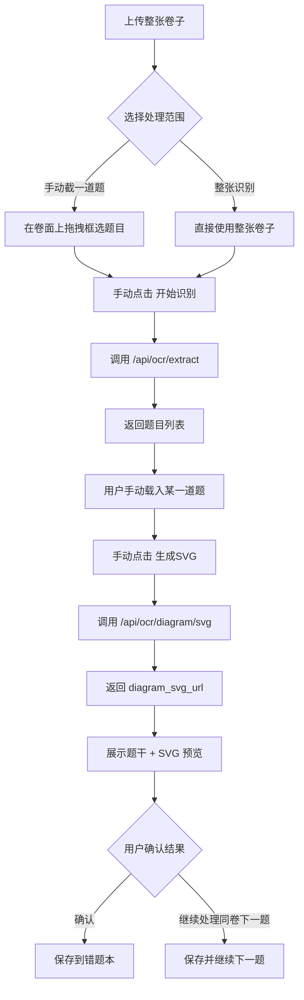

# 上传整张卷子后的题目处理流程

> Status: current  
> Scope: 当前真实前端交互流程  
> Confirmed path: `LLM 生成 SVG`  
> Main entry: `lf-smart-paper-web/src/pages/student/StudentDashboardPage.jsx`

## 结论

这份文档描述的不是“后端 OCR 内部所有细节”，而是当前产品里真正给用户使用的链路。

当前确认后的真实流程是：

1. 上传整张卷子
2. 手动选择处理范围
   - 手动框出一道题
   - 或直接整张识别
3. 手动点击开始识别
4. OCR 返回题目列表
5. 手动选择某一道题并触发 `LLM 生成 SVG`
6. 人工确认文字和 SVG 结果
7. 保存结果
   - `保存到错题本`
   - 或 `保存并继续下一题`

## 为什么旧版流程图不准确

旧版文档偏向“后端 `/api/ocr/extract` 的完整技术流水线”，会让人误以为：

- 上传后会自动开始识别
- 图示处理会自动走本地抠图 / LLM 抠图 / SVG 三条链路
- 保存前不需要人工确认

但当前前端已经不是这个交互。

当前真实产品逻辑是：

- 上传后不自动 OCR
- 必须由用户手动触发识别
- 当前确认使用的是 `LLM 生成 SVG` 这条链路
- 图示结果生成后仍然要人工确认，再决定保存

## 当前真实流程图

## 分步骤说明

### 1. 上传整张卷子

用户入口在学生端弹窗里，而不是旧的独立上传页。

当前页面支持三种图片入口：

- 拍照
- 相册
- 上传文件

相关实现：

- `StudentDashboardPage.jsx`
- `onPickCamera()`
- `onPickPhoto()`
- `onPickUpload()`
- `onUseFile()`

当前行为：

- 上传图片后，只做本地加载和预览
- 不自动调用 `/api/ocr/extract`

### 2. 手动选择处理范围

当前有两个识别范围：

- `manual_question`
- `full_page`

对应文案：

- `手动截一道题`
- `整张识别`

当选择 `手动截一道题` 时：

- 用户在整张卷面上拖拽框选区域
- 当前还支持放大 / 缩小 / 100% 预览
- 选区按原图坐标保存，缩放不会导致错位

相关实现：

- `RECOGNITION_SCOPES`
- `onPaperMouseDown()`
- `onPaperMouseMove()`
- `onPaperMouseUp()`
- `updatePaperZoom()`

### 3. 手动点击开始识别

识别是手动触发的，不再是上传即识别。

按钮文案根据范围变化：

- `识别选中区域`
- `识别整张`

触发逻辑：

- `onRunRealOcr()`
- `buildRecognitionTarget()`

其中：

- 如果是 `整张识别`，直接上传整张图到 `/api/ocr/extract`
- 如果是 `手动截一道题`，先把用户框选区域裁成新图片，再上传到 `/api/ocr/extract`

## 4. OCR 返回题目列表

接口仍然是：

- `POST /api/ocr/extract`

前端当前把它当成“手动触发的题目提取接口”使用，而不是自动后台流水线。

返回后：

- 前端展示题目列表
- 用户手动选择要处理的一题

相关实现：

- `extractQuestions()`
- `normalizeOcrItems()`
- `ocrItems`

## 5. 用户手动选择某一道题

OCR 返回多题时，不会自动进入完整保存链路。

用户需要先：

- 点击卡片
- 或点击 `载入题目`

这一步的作用是：

- 把题干文字带入当前编辑表单
- 进入“这道题准备处理”的状态

相关实现：

- `applyOcrTextOnly(item)`

## 6. 手动触发 LLM 生成 SVG

当前确认采用的图示链路是：

- `LLM 生成 SVG`

不是：

- 自动本地抠图
- 自动 LLM 抠图

用户在某一题上点击：

- `生成SVG`

然后前端调用：

- `POST /api/ocr/diagram/svg`

请求里会带：

- `item_id`
- `question_text`
- `question_image_url`
- `diagram_image_url`

接口返回：

- `diagram_svg_url`

前端随后：

- 将 SVG 结果写回当前题目
- 将 SVG 加载到当前表单预览

相关实现：

- `onApplyOcrItem(item, false, "llm_svg")`
- `generateDiagramSvg()`

## 7. 人工确认结果

生成 SVG 后并不会自动保存。

用户需要人工确认：

- 题目文字是否正确
- SVG 是否可用
- 是否需要手动改标题 / 学科 / 错题分类 / 错因 / 内容

当前页面会展示：

- 题目识别结果区
- SVG 预览区
- 错题卡片预览区
- 表单编辑区

这一步是当前流程中必须保留的人工确认环节。

## 8. 保存结果

当前有两个保存动作：

- `保存到错题本`
- `保存并继续下一题`

区别：

### 保存到错题本

- 保存当前题目
- 关闭当前录入流程

### 保存并继续下一题

- 保存当前题目
- 保留当前整张卷子的上下文
- 清空本题处理状态
- 用户可以继续在同一张卷子上框下一题

相关实现：

- `persistWrongQuestion(false)`
- `persistWrongQuestion(true)`

## 当前真实链路涉及的接口

### 必走接口

- `POST /api/ocr/extract`
- `POST /api/ocr/diagram/svg`

### 当前确认链路中不作为主流程的接口

- `POST /api/ocr/diagram/crop`

说明：

- `diagram/crop` 还在代码里
- 但当前确认流程不把它作为主链路
- 当前主链路是 `extract -> 选题 -> diagram/svg -> 人工确认 -> 保存`

## 推荐作为产品对齐口径的简化版本

可以直接对外描述为：

> 用户先上传整张卷子。  
> 系统不会自动识别，而是先让用户手动选择“整张识别”或“框出一道题再识别”。  
> OCR 返回题目后，用户再手动选择其中一道题，点击生成 SVG。  
> 系统返回 SVG 预览，用户确认无误后保存到错题本；如果还要继续处理同一张卷子，可以直接保存并继续下一题。

## 如果后续要补文档，建议分成两份

为了避免继续混淆，建议后续拆成两份文档：

1. `用户流程文档`
   - 只写真实交互
   - 面向产品 / 前端 / 评审

2. `后端技术流水线文档`
   - 专门写 `/api/ocr/extract` 内部处理细节
   - 包括预处理、OCR、框归一化、图示提取、置信度等

这样不会再把“后端内部实现图”误当成“用户实际操作流程图”。
